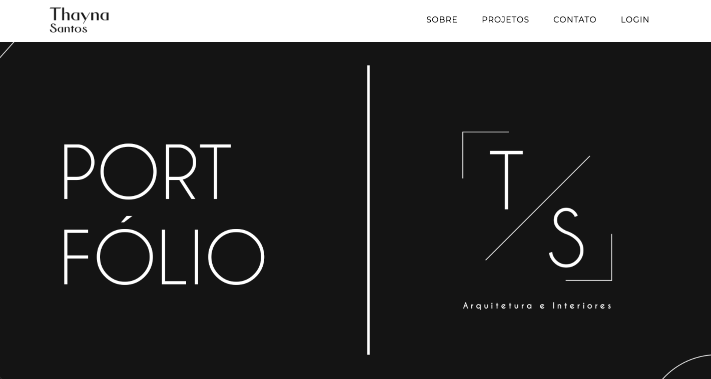

# Portfolio - Arquitetura

<!-- 

    

 -->

## Overview
The main purpose of this project is to create a webpage to a cliente about her architecture projects.

## Libraries 

- Bcrypt => Crypt password;
- Body-parser => Bypass json data;
- DotEnv => Work with envkeys;
- EJS => Render HTML;
- Express => Flexible framework;
- Express-session => create specific routes for admins controller;
- JWT: Json Web Token => Security Access 
- Mysql2 => Data base;
- Nodemon => Update server when save;
- Sequelize => Manipulate database;
- Slugify => Replaces spaces with hyphen from saved text;
- TinyMCE => Manage blog hyper text

## Running the application

- Run: `docker-compose build`;
- Run: `docker-compose up`;

- Link: You can access the web page on `http://localhost:3000/`

## Licenses
 

    

